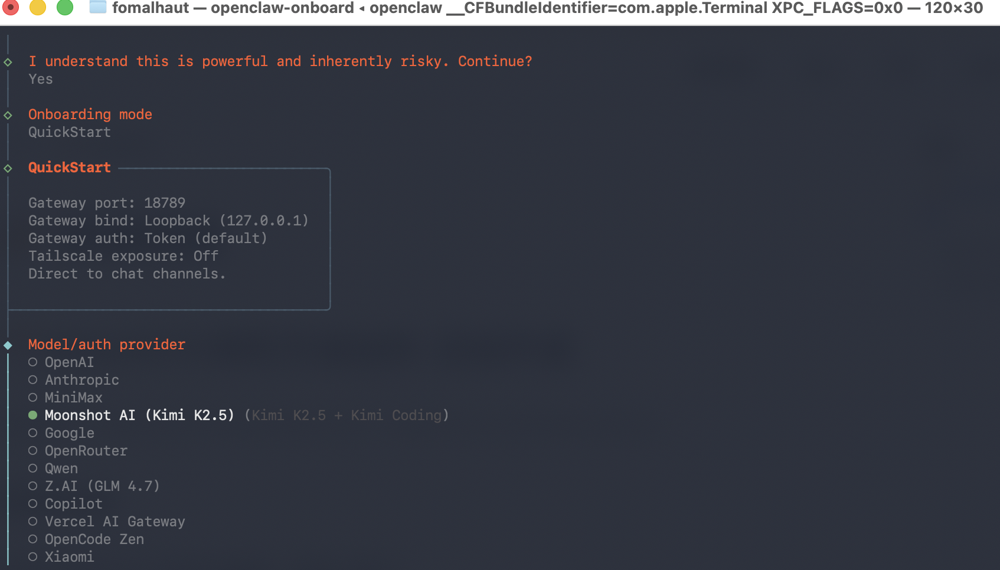

# 安装流程
终端运行记录参见[openclaw安装](openclaw安装.md)
1. 事前准备
	- 建议在MacOS或者是Linux系统上运行
	- 安装node.js，参见[Node.js基本介绍](../工具相关/Node.js/Node.js基本介绍.md)
	- 根据openclaw官网，通过npm进行安装`npm i -g openclaw`（有人说ubuntu系统不能通过npm安装，存疑）

2. 选择AI大语言模型
	- 最终选择了Minimax APi，利用原先已经有的余额进行测试
3. 选择对话频道
	- 由于telegram外网连接不稳定，可以通过飞书进行对话
	- 安装后遇到报错（未解决）
	- debug过程见[和grok对话过程](https://x.com/i/grok/share/4373a24e294e48fba9bc0fa2d89301ed)
4. 安装skills
	- 选择了：🐙 github, 📊 model-usage, 💎 obsidian
	- 全部安装失败
5. 设置不同的API（全部都选择了no）
6. 安装 Gateway service
7. 可以开始对话（无输出）

