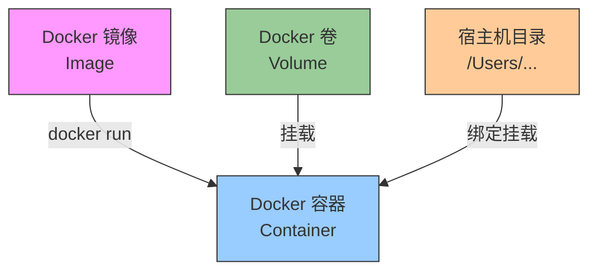

### 物理存储位置

Docker 容器实际上不是单个文件，而是由多个层（layers）组成的文件系统，存储在 Docker 的存储目录中：

**macOS 上的 Docker 存储位置：**

```
# Docker 虚拟机的位置（macOS 特有）
~/Library/Containers/com.docker.docker/
~/Library/Group Containers/group.com.docker/

# 实际的容器文件系统在这台 Linux 虚拟机内部
# 您不能直接访问，需要通过 Docker 命令
```

### 容器 vs 镜像 vs 卷

理解这三个概念很重要：

- **镜像 (Image)**：只读模板，包含应用程序和依赖
- **容器 (Container)**：镜像的运行实例，可读写
- **卷 (Volume)**：持久化数据存储




很好的问题！我来详细解答 Docker 容器的相关知识。

## 1. Docker Container 的“位置”在哪里？

### 物理存储位置
Docker 容器实际上不是单个文件，而是由多个层（layers）组成的文件系统，存储在 Docker 的存储目录中：

**macOS 上的 Docker 存储位置：**
```bash
# Docker 虚拟机的位置（macOS 特有）
~/Library/Containers/com.docker.docker/
~/Library/Group Containers/group.com.docker/

# 实际的容器文件系统在这台 Linux 虚拟机内部
# 您不能直接访问，需要通过 Docker 命令
```

### 容器 vs 镜像 vs 卷

理解这三个概念很重要：


- **镜像 (Image)**：只读模板，包含应用程序和依赖
- **容器 (Container)**：镜像的运行实例，可读写
- **卷 (Volume)**：持久化数据存储

## 2. 查看容器情况的两种方式

### 方式一：命令行方式（推荐，信息更全）

#### 查看运行中的容器
```bash
# 列出运行中的容器
docker ps

# 列出所有容器（包括停止的）
docker ps -a

# 以更友好的格式显示
docker ps --format "table {{.Names}}\t{{.Status}}\t{{.Image}}\t{{.Ports}}"
```

#### 查看特定容器的详细信息
```bash
# 查看容器详情（JSON格式）
docker inspect active-call

# 查看容器日志
docker logs active-call
docker logs -f active-call  # 实时跟踪

# 查看容器资源使用
docker stats active-call

# 查看容器内的进程
docker top active-call

# 查看容器端口映射
docker port active-call
```

#### 进入容器内部查看
```bash
# 进入正在运行的容器（交互式shell）
docker exec -it active-call sh

# 或者用 bash（如果容器有bash）
docker exec -it active-call bash

# 进入后可以查看文件系统
ls -la /
ls -la /models/
ls -la /app/
```

#### 查看容器挂载的卷
```bash
# 查看容器的挂载点
docker inspect active-call | grep -A 10 "Mounts"

# 更简洁的方式
docker inspect --format='{{json .Mounts}}' active-call | jq .
```

### 方式二：Docker Desktop 图形界面

Docker Desktop 提供了直观的图形界面：

1. **打开 Docker Desktop**
   - 点击菜单栏的 Docker 图标
   - 选择 "Dashboard"

2. **查看容器列表**
   - 左侧导航栏点击 "Containers"
   - 可以看到所有容器的状态、名称、镜像等

3. **容器操作界面**
   - 点击任一容器，可以：
     - 查看日志（Logs）
     - 查看统计信息（Stats）
     - 进入终端（Exec）
     - 查看文件系统（Files）
     - 检查配置（Inspect）

4. **查看文件系统**
   - 在容器详情页点击 "Files" 选项卡
   - 可以浏览容器内的所有文件
   - 您之前说的就是在 Desktop 的 Files 中看到 `/models/sensevoice`


## 实用的 Docker 命令速查表

```bash
# 容器生命周期
docker start active-call    # 启动已存在的容器
docker stop active-call     # 停止容器
docker restart active-call  # 重启容器
docker rm active-call       # 删除容器

# 查看信息
docker logs -f active-call  # 查看实时日志
docker stats                # 查看所有容器资源使用
docker system df            # 查看磁盘使用

# 清理
docker container prune      # 删除所有停止的容器
docker system prune         # 清理所有未使用的资源

# 容器与宿主机文件传输
docker cp active-call:/app/config ./backup/  # 从容器复制到宿主机
docker cp ./config active-call:/app/         # 从宿主机复制到容器
```